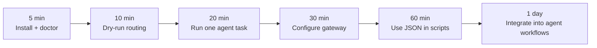

# cli-switch

**AI Agent Capability Router for coding CLIs.**

[](https://www.npmjs.com/package/cli-switch)
[](https://nodejs.org/)
[](./LICENSE)
[](https://www.typescriptlang.org/)

`cli-switch` is a command-line orchestration layer for AI coding agents. It
routes a task to the right agent, injects gateway credentials, chooses model
tiers, isolates the child process environment, and returns text or JSON output
that scripts and higher-level agents can consume.

Current public package: `cli-switch@0.3.2`

## Languages

- [English](#english)
- [中文](#中文)
- [日本語](#日本語)
- [한국어](#한국어)

---

## English

### What It Is

Modern coding agents are powerful, but every CLI has different authentication,
model flags, environment variables, strengths, and failure modes. `cli-switch`
adds a routing layer above those tools:

```text
task
  -> intent and capability detection
  -> agent and tier selection
  -> gateway credential injection
  -> sandboxed child process execution
  -> text or JSON result
```

It is designed for developers, automation scripts, and agent frameworks that
need one stable interface for multiple coding agents.

### What You Can Use It For

- Route coding tasks between Claude Code and Codex CLI.
- Use one gateway or self-hosted relay API key across supported agents.
- Reuse OpenRouter-style keys without changing each agent's global config.
- Run dry-run routing decisions before spending model tokens.
- Build higher-level agent workflows that need stable JSON output.
- Dispatch review, test-writing, refactor, explain, analysis, and fix tasks.
- Keep parent session variables out of child agent processes.
- Inspect local agent readiness with diagnostics and auth checks.

### Good Fit

| Scenario | Why `cli-switch` helps |
| --- | --- |
| Multi-agent coding workflow | Select Claude Code or Codex per task instead of hard-coding one tool. |
| Self-hosted LLM relay | Map relay credentials into agent-native env variables automatically. |
| Agent framework integration | Use `--json`, `--dry-run`, and stable command surfaces. |
| Cost and quality routing | Route by `economy`, `standard`, or `premium` model tiers. |
| CI-style diagnostics | Check env, auth, models, providers, and runtime specs from scripts. |

### Current Status

`cli-switch@0.3.2` is a usable early release. It is ready for practical testing
and internal workflows, but it is not the full v2.0 roadmap product yet.

Implemented today:

- `cli-switch run <task>` with smart routing.
- Agent override with `--agent claude-code|codex`.
- Execution modes: `single`, `write_review`, `write_test_fix`.
- Tier routing: `economy`, `standard`, `premium`.
- Gateway aliases: `SWITCH_*`, `SWITCH_RELAY_*`, `OPENROUTER_*`.
- JSON output for automation.
- Diagnostics: `resolve`, `env`, `auth status`, `doctor`, `list`.
- Capability matrix and benchmark simulation commands.
- Process environment isolation and gateway HOME isolation.
- Full TypeScript build and automated test suite.

Known limits:

- `--strategy balanced|high_quality|low_cost` is accepted but not implemented
  as a runtime cost strategy selector yet.
- Gateway injection currently targets Claude Code and Codex.
- Sandbox support is environment-level in v0.3.0. Full file policy, patch-only
  execution, temporary project copies, and worktree isolation are future work.
- `config show/set/reset` commands are not implemented yet.

### Install

```bash
npm install -g cli-switch
```

Verify:

```bash
cli-switch --version
cli-switch doctor --json
```

From source:

```bash
git clone https://github.com/zhoutian1995/cli-switch.git
cd cli-switch
npm install
npm run build
npm link
```

### Quick Start

Preview a routing decision:

```bash
cli-switch run "refactor the auth module" --dry-run
```

Run with automatic routing:

```bash
cli-switch run "write tests for the payment parser"
```

Force a specific agent:

```bash
cli-switch run "fix this TypeScript error" --agent codex
cli-switch run "review this architecture change" --agent claude-code
```

Use JSON output:

```bash
cli-switch run "explain this repository" --json
```

Use a model tier:

```bash
cli-switch run "debug the failing e2e test" --tier premium
```

Use an execution mode:

```bash
cli-switch run "implement login validation" --execution write_test_fix
```

### Gateway And Relay Configuration

Preferred variables:

```bash
export SWITCH_API_KEY=your-gateway-key
export SWITCH_BASE_URL=https://your-relay.example.com/v1
export SWITCH_MODEL_ECONOMY=your-economy-model
export SWITCH_MODEL_STANDARD=your-standard-model
export SWITCH_MODEL_PREMIUM=your-premium-model
```

Self-hosted relay aliases:

```bash
export SWITCH_RELAY_API_KEY=your-relay-key
export SWITCH_RELAY_BASE_URL=https://your-relay.example.com/v1
```

OpenRouter-compatible aliases:

```bash
export OPENROUTER_API_KEY=sk-or-v1-xxx
export OPENROUTER_BASE_URL=https://openrouter.ai/api/v1
```

Priority:

```text
SWITCH_* > SWITCH_RELAY_* > OPENROUTER_*
```

When gateway mode is enabled:

| Agent | Injected variables | Model flag |
| --- | --- | --- |
| Claude Code | `ANTHROPIC_API_KEY`, `ANTHROPIC_BASE_URL` | `--model` |
| Codex CLI | `OPENAI_API_KEY`, `OPENAI_BASE_URL` | `-m` |

If no gateway key is configured, the agent uses its native local auth.

### Commands

```bash
cli-switch resolve       # Resolve tool/profile/model to a runtime spec
cli-switch env           # Inspect environment and config sources
cli-switch auth status   # Check auth status for a tool
cli-switch doctor        # Run diagnostics
cli-switch list          # List models, providers, and profiles
cli-switch run           # Route and run an AI agent
cli-switch capabilities  # Show the capability matrix
cli-switch benchmark     # Run capability simulations across agents
```

Current `run` options:

```text
--mode <mode>        single|orchestrator|handoff|review
--agent <agent>      claude-code|codex
--strategy <name>    balanced|high_quality|low_cost (accepted, not implemented)
--execution <mode>   single|write_review|write_test_fix
--tier <tier>        economy|standard|premium
--json               output JSON
--dry-run            show routing decision without executing
--timeout <seconds>  agent timeout, default 120
--reviewer <agent>   reviewer agent for review mode
--no-git             skip Git guard
--rollback           try rollback on failure
--stream             stream output, default true
--no-stream          disable streaming
--interactive        interactive agent selection
--acp                JSON-RPC over stdio bridge
```

### Start Curve



### Architecture

```text
cmd/                  CLI command entrypoints
src/core/router/      capability and model routing
src/core/gateway/     gateway config and env injection
src/core/dispatcher/  agent process management
src/core/sandbox/     environment and HOME isolation helpers
src/core/strategy/    execution mode engine
src/registry/         built-in agents, models, providers, profiles
schema/               runtime and config JSON schemas
test/                 unit, contract, e2e, and stress tests
```

### Development

```bash
npm run build
npm test
npm run smoke
npm run lint
```

Verification baseline:

```text
35 test files
318 tests passing
```

### Roadmap

- Short term: stricter provider/vendor/transport resolution, platform and
  binary preflight checks, error-code closure, user config overrides.
- Mid term: richer execution policy, better strategy controls, stronger output
  validation.
- Later: full file sandboxing, patch-only execution, temporary project copies,
  worktree isolation, and richer skill workflows.

---

## 中文

### 它是什么

`cli-switch` 是面向 AI 编程 CLI 的 **Agent Capability Router（能力路由执行层）**。
它不是新的模型，也不是 Claude Code / Codex CLI 的替代品，而是位于这些工具上方
的一层统一入口：

```text
任务输入
  -> 意图与能力识别
  -> Agent 与模型档位选择
  -> 中转站 / Gateway 凭据注入
  -> 子进程沙盒执行
  -> 文本或 JSON 结果
```

核心目标是让上层 Agent、自动化脚本或开发者不再直接关心“这个任务到底该用哪个
Agent、哪个模型、哪个 API Key、哪个命令参数”。你只描述任务，`cli-switch` 负责
把任务路由到合适的执行器。

### 为什么要做

AI 编程工具越来越多，但它们的调用方式并不统一：

- Claude Code、Codex CLI 等工具各自有不同的认证方式和环境变量。
- 不同 Agent 擅长的任务不同，例如复杂重构、测试生成、错误修复、代码解释。
- 自建中转站、OpenRouter、第三方 Gateway 通常需要把同一套 API Key 映射成不同
  Agent 原生变量。
- 上层 Agent 需要稳定 JSON 输出，而不是解析各个 CLI 的非结构化终端输出。
- 直接让子进程继承用户全局 HOME 和会话变量，容易产生配置污染和不可重复行为。

`cli-switch` 解决的是“多 Agent 能力调用标准化”的问题：把不同 CLI 包装成统一能力，
让系统根据任务自动选择 Agent、模型档位和执行策略。

### 它能做什么

- 在 Claude Code 和 Codex CLI 之间进行任务路由。
- 使用 `--agent` 强制指定某个 Agent。
- 使用 `--tier economy|standard|premium` 表达成本/质量档位。
- 使用 `--execution single|write_review|write_test_fix` 表达执行流程。
- 把自建中转站或 OpenRouter 兼容 Key 注入为 Claude/Codex 需要的原生环境变量。
- 用 `--dry-run` 查看路由决策，避免盲目消耗模型调用。
- 用 `--json` 接入脚本、CI、上层 Agent 或自动化系统。
- 用 `doctor`、`env`、`auth status`、`resolve` 检查本地环境和运行时配置。
- 隔离子进程环境，清理父进程会话变量，并在 gateway 场景使用临时 HOME。

### 适用场景

| 场景 | cli-switch 的作用 |
| --- | --- |
| 多 Agent 编程工作流 | 按任务选择 Claude Code 或 Codex，而不是把流程写死到一个工具上。 |
| 自建 LLM 中转站 | 把 `SWITCH_API_KEY` / `SWITCH_RELAY_API_KEY` 自动映射到 Agent 原生变量。 |
| OpenRouter 兼容网关 | 复用 `OPENROUTER_API_KEY` / `OPENROUTER_BASE_URL`。 |
| Hermes / OpenClaw 等上层 Agent | 提供稳定 CLI 和 JSON 输出，方便作为底层能力调用。 |
| 自动化脚本和 CI | 先诊断环境，再执行任务，并以结构化结果回传。 |
| 成本与质量分层 | 用 `economy`、`standard`、`premium` 表达模型档位，而不是到处写死模型名。 |

### 当前状态

`cli-switch@0.3.2` 已发布到 npm，可以用于早期真实工作流和内部自动化验证。
它已经是可运行的 v0.3.x 基线，但还不是 PRD 中完整的 v2.0 产品形态。

当前已实现：

- `cli-switch run <任务>` 智能路由执行。
- `--agent claude-code|codex` 指定执行器。
- `--tier economy|standard|premium` 模型档位。
- `--execution single|write_review|write_test_fix` 执行模式。
- `SWITCH_*`、`SWITCH_RELAY_*`、`OPENROUTER_*` Gateway 环境变量。
- JSON 输出。
- `resolve`、`env`、`auth status`、`doctor`、`list` 等诊断命令。
- 能力矩阵和 benchmark simulation 命令。
- 子进程环境隔离和 gateway HOME 隔离。
- TypeScript 构建与自动化测试。

当前边界：

- `--strategy balanced|high_quality|low_cost` 目前会被接受并提示 warning，但还没有真正
  作为运行时成本策略生效。
- Gateway 注入当前主要面向 Claude Code 和 Codex。
- 沙盒是 v0.1 范围：环境隔离 + gateway HOME 隔离。完整文件系统白名单、patch-only
  输出、临时项目副本、worktree 隔离仍是后续目标。
- `config show/set/reset` 还没有实现。

### 安装与快速开始

```bash
npm install -g cli-switch
cli-switch --version
cli-switch doctor --json
```

查看路由决策：

```bash
cli-switch run "帮我重构 auth 模块" --dry-run
```

自动选择 Agent 执行：

```bash
cli-switch run "给 payment parser 写测试"
```

指定 Agent：

```bash
cli-switch run "修复这个 TypeScript 错误" --agent codex
cli-switch run "审查这个架构改动" --agent claude-code
```

输出 JSON：

```bash
cli-switch run "解释这个仓库" --json
```

### 中转站 / Gateway 配置

推荐显式使用 `SWITCH_*`：

```bash
export SWITCH_API_KEY=your-gateway-key
export SWITCH_BASE_URL=https://your-relay.example.com/v1
export SWITCH_MODEL_ECONOMY=your-economy-model
export SWITCH_MODEL_STANDARD=your-standard-model
export SWITCH_MODEL_PREMIUM=your-premium-model
```

自建中转站别名：

```bash
export SWITCH_RELAY_API_KEY=your-relay-key
export SWITCH_RELAY_BASE_URL=https://your-relay.example.com/v1
```

OpenRouter 兼容变量：

```bash
export OPENROUTER_API_KEY=sk-or-v1-xxx
export OPENROUTER_BASE_URL=https://openrouter.ai/api/v1
```

优先级：

```text
SWITCH_* > SWITCH_RELAY_* > OPENROUTER_*
```

### 上手曲线


### 路线图

- 短期：收紧 provider/vendor/transport 解析、平台与二进制前置检查、错误码闭环。
- 中期：增强执行策略、配置覆盖层、输出校验和自动修复。
- 后续：完整文件沙盒、patch-only 执行、临时项目副本、worktree 隔离和更完整的 Skill 工作流。

---

## 日本語

### What / これは何か

`cli-switch` は AI コーディング CLI のための **Agent Capability Router** です。
Claude Code や Codex CLI を置き換えるものではなく、それらの上に置く統一実行
レイヤーです。

```text
タスク入力
  -> 意図と Capability の判定
  -> Agent とモデル Tier の選択
  -> Gateway 認証情報の注入
  -> 分離された子プロセスで実行
  -> テキストまたは JSON 結果
```

開発者、自動化スクリプト、上位 Agent フレームワークが、複数の AI コーディング
Agent を 1 つの安定した CLI インターフェースから呼び出せるようにすることが目的です。

### Why / なぜ必要か

AI コーディング CLI は強力ですが、実運用では次の問題があります。

- ツールごとに認証方式、環境変数、モデル指定フラグが異なる。
- Agent ごとに得意領域が違うため、タスクごとの使い分けが必要。
- 自前の LLM relay や OpenRouter 互換 Gateway を使う場合、同じ Key を各 CLI の
  ネイティブ環境変数へ変換する必要がある。
- 上位 Agent や CI では、端末向けの非構造化出力より安定した JSON が必要。
- 親プロセスのセッション変数や HOME 配下の設定をそのまま引き継ぐと、再現性と安全性が落ちる。

`cli-switch` はこれらを「Capability Routing」という形で標準化します。
ユーザーはタスクを渡し、システムが Agent、モデル Tier、実行モードを選びます。

### What You Can Do / できること

- Claude Code と Codex CLI の間でタスクをルーティングする。
- `--agent` で Agent を明示的に指定する。
- `--tier economy|standard|premium` でコストと品質のバランスを指定する。
- `--execution single|write_review|write_test_fix` で実行フローを指定する。
- 自前 Gateway / OpenRouter 互換 Key を Agent ネイティブ環境変数へ注入する。
- `--dry-run` で実行前にルーティング判断を確認する。
- `--json` でスクリプトや上位 Agent に接続する。
- `doctor`、`env`、`auth status`、`resolve` で環境と設定を診断する。

### Use Cases / 利用シーン

| シーン | 役立つ理由 |
| --- | --- |
| 複数 Agent の開発ワークフロー | Claude Code と Codex をタスクごとに切り替えられる。 |
| 自前 LLM relay | 1 つの Gateway Key を各 Agent の形式へ自動変換できる。 |
| OpenRouter 互換 Gateway | `OPENROUTER_API_KEY` をそのまま再利用できる。 |
| Agent フレームワーク連携 | 安定した CLI と JSON 出力を下位 Capability として使える。 |
| CI / 自動化 | 診断、ルーティング、実行結果をスクリプトで扱いやすい。 |

### Current Status / 現在の状態

`cli-switch@0.3.2` は npm で公開済みの早期リリースです。実用テストや社内
ワークフローには利用できますが、PRD にある v2.0 の全機能はまだ実装されていません。

実装済み：

- `cli-switch run <task>` によるスマートルーティング。
- `--agent claude-code|codex`。
- `--tier economy|standard|premium`。
- `--execution single|write_review|write_test_fix`。
- `SWITCH_*`、`SWITCH_RELAY_*`、`OPENROUTER_*` の Gateway 変数。
- JSON 出力。
- `resolve`、`env`、`auth status`、`doctor`、`list`。
- Capability matrix と benchmark simulation。
- 子プロセス環境の分離と Gateway 利用時の HOME 分離。

制限：

- `--strategy balanced|high_quality|low_cost` は受け付けますが、実際の runtime cost
  strategy としてはまだ動作しません。
- Gateway 注入の主対象は Claude Code と Codex です。
- Sandbox は現時点では環境レベルです。完全な file policy、patch-only 実行、
  temporary project copy、worktree isolation は今後の作業です。
- `config show/set/reset` は未実装です。

### Quick Start / クイックスタート

```bash
npm install -g cli-switch
cli-switch --version
cli-switch doctor --json
```

```bash
cli-switch run "refactor the auth module" --dry-run
cli-switch run "write tests for the payment parser"
cli-switch run "fix this TypeScript error" --agent codex
cli-switch run "review this architecture change" --agent claude-code
cli-switch run "explain this repository" --json
```

### Gateway 設定

```bash
export SWITCH_API_KEY=your-gateway-key
export SWITCH_BASE_URL=https://your-relay.example.com/v1
export SWITCH_MODEL_ECONOMY=your-economy-model
export SWITCH_MODEL_STANDARD=your-standard-model
export SWITCH_MODEL_PREMIUM=your-premium-model
```

```bash
export SWITCH_RELAY_API_KEY=your-relay-key
export SWITCH_RELAY_BASE_URL=https://your-relay.example.com/v1
```

```bash
export OPENROUTER_API_KEY=sk-or-v1-xxx
export OPENROUTER_BASE_URL=https://openrouter.ai/api/v1
```

優先順位：

```text
SWITCH_* > SWITCH_RELAY_* > OPENROUTER_*
```

### Start Curve / 導入ステップ


### Roadmap / ロードマップ

- Short term: provider/vendor/transport の厳密化、platform/binary preflight checks、error-code closure。
- Mid term: execution policy、strategy controls、output validation の強化。
- Later: full file sandboxing、patch-only execution、temporary project copies、worktree isolation。

---

## 한국어

### What / 무엇인가

`cli-switch`는 AI 코딩 CLI를 위한 **Agent Capability Router**입니다. Claude Code나
Codex CLI를 대체하는 도구가 아니라, 여러 코딩 Agent 위에서 하나의 안정적인 실행
인터페이스를 제공하는 오케스트레이션 레이어입니다.

```text
작업 입력
  -> 의도와 Capability 감지
  -> Agent와 모델 Tier 선택
  -> Gateway 인증 정보 주입
  -> 격리된 자식 프로세스에서 실행
  -> 텍스트 또는 JSON 결과
```

개발자, 자동화 스크립트, 상위 Agent 프레임워크가 여러 AI 코딩 CLI를 일관된 방식으로
호출할 수 있게 만드는 것이 목표입니다.

### Why / 왜 필요한가

AI 코딩 CLI는 각각 강력하지만 실제 워크플로에서는 다음 문제가 생깁니다.

- 도구마다 인증 방식, 환경 변수, 모델 플래그가 다르다.
- Agent마다 잘하는 일이 다르므로 작업별 선택이 필요하다.
- 자체 LLM relay나 OpenRouter 호환 Gateway를 쓰면 같은 Key를 각 CLI의 네이티브
  환경 변수로 매핑해야 한다.
- 상위 Agent와 자동화 스크립트는 사람이 보는 터미널 출력보다 안정적인 JSON이 필요하다.
- 부모 프로세스의 세션 변수와 HOME 설정을 그대로 넘기면 재현성과 격리가 약해진다.

`cli-switch`는 이 문제를 Capability Routing으로 정리합니다. 사용자는 작업을 전달하고,
시스템이 Agent, 모델 Tier, 실행 모드를 선택합니다.

### What You Can Do / 할 수 있는 일

- Claude Code와 Codex CLI 사이에서 작업을 라우팅한다.
- `--agent`로 특정 Agent를 강제한다.
- `--tier economy|standard|premium`으로 비용과 품질 수준을 표현한다.
- `--execution single|write_review|write_test_fix`로 실행 흐름을 지정한다.
- 자체 Gateway 또는 OpenRouter 호환 Key를 Agent 네이티브 환경 변수로 주입한다.
- `--dry-run`으로 실행 전에 라우팅 결정을 확인한다.
- `--json`으로 스크립트, CI, 상위 Agent에 연결한다.
- `doctor`, `env`, `auth status`, `resolve`로 로컬 환경과 인증 상태를 점검한다.

### Use Cases / 사용 시나리오

| 시나리오 | 도움이 되는 이유 |
| --- | --- |
| 멀티 Agent 코딩 워크플로 | Claude Code와 Codex를 작업별로 선택할 수 있다. |
| 자체 LLM relay | 하나의 Gateway Key를 각 Agent 형식으로 자동 매핑한다. |
| OpenRouter 호환 Gateway | `OPENROUTER_API_KEY`와 `OPENROUTER_BASE_URL`을 재사용한다. |
| Agent 프레임워크 통합 | 안정적인 CLI와 JSON 출력을 하위 Capability로 사용할 수 있다. |
| 자동화 / CI | 진단, 라우팅, 실행 결과를 스크립트에서 다루기 쉽다. |

### Current Status / 현재 상태

`cli-switch@0.3.2`는 npm에 공개된 초기 사용 가능 버전입니다. 실제 내부 워크플로와
테스트에는 사용할 수 있지만, PRD의 전체 v2.0 기능이 모두 구현된 것은 아닙니다.

현재 구현됨:

- `cli-switch run <task>` 스마트 라우팅.
- `--agent claude-code|codex`.
- `--tier economy|standard|premium`.
- `--execution single|write_review|write_test_fix`.
- `SWITCH_*`, `SWITCH_RELAY_*`, `OPENROUTER_*` Gateway 변수.
- JSON 출력.
- `resolve`, `env`, `auth status`, `doctor`, `list`.
- Capability matrix와 benchmark simulation.
- 자식 프로세스 환경 격리와 Gateway HOME 격리.

제한:

- `--strategy balanced|high_quality|low_cost`는 옵션으로 받지만 실제 runtime cost
  strategy로는 아직 동작하지 않는다.
- Gateway 주입은 현재 Claude Code와 Codex가 주요 대상이다.
- Sandbox는 현재 환경 격리 수준이다. full file policy, patch-only execution,
  temporary project copy, worktree isolation은 이후 작업이다.
- `config show/set/reset`은 아직 없다.

### Quick Start / 빠른 시작

```bash
npm install -g cli-switch
cli-switch --version
cli-switch doctor --json
```

```bash
cli-switch run "refactor the auth module" --dry-run
cli-switch run "write tests for the payment parser"
cli-switch run "fix this TypeScript error" --agent codex
cli-switch run "review this architecture change" --agent claude-code
cli-switch run "explain this repository" --json
```

### Gateway 설정

```bash
export SWITCH_API_KEY=your-gateway-key
export SWITCH_BASE_URL=https://your-relay.example.com/v1
export SWITCH_MODEL_ECONOMY=your-economy-model
export SWITCH_MODEL_STANDARD=your-standard-model
export SWITCH_MODEL_PREMIUM=your-premium-model
```

```bash
export SWITCH_RELAY_API_KEY=your-relay-key
export SWITCH_RELAY_BASE_URL=https://your-relay.example.com/v1
```

```bash
export OPENROUTER_API_KEY=sk-or-v1-xxx
export OPENROUTER_BASE_URL=https://openrouter.ai/api/v1
```

우선순위:

```text
SWITCH_* > SWITCH_RELAY_* > OPENROUTER_*
```

### Start Curve / 시작 곡선


### Roadmap / 로드맵

- Short term: provider/vendor/transport 해석 강화, platform/binary preflight checks, error-code closure.
- Mid term: execution policy, strategy controls, output validation 강화.
- Later: full file sandboxing, patch-only execution, temporary project copies, worktree isolation.

---

## License

MIT

### 适用场景

- 你同时使用 Claude Code 和 Codex，希望按任务自动选择。
- 你有自建中转站，希望一套 API Key 映射到不同 Agent。
- 你在做 Hermes、OpenClaw 或其他 Agent 工作流，需要稳定 CLI 接口。
- 你希望先 `--dry-run` 看路由决策，再真正执行。
- 你希望用 `--json` 把 AI 编程能力接入自动化脚本。
- 你希望避免 Claude/Codex 子进程读取父进程会话变量或全局配置污染任务。

### 当前能力

- 已发布 npm 包：`cli-switch@0.3.2`。
- 支持 `cli-switch run <任务>`。
- 支持 `--agent claude-code|codex`。
- 支持 `--tier economy|standard|premium`。
- 支持 `--execution single|write_review|write_test_fix`。
- 支持 `SWITCH_*`、`SWITCH_RELAY_*`、`OPENROUTER_*` 环境变量。
- 支持 `resolve`、`env`、`auth status`、`doctor`、`list` 等诊断命令。
- 支持基础沙盒：环境变量隔离、gateway 场景临时 HOME 隔离。

### 边界说明

当前版本是 v0.3.0 可用基线，不是完整 v2.0。完整文件系统沙盒、patch-only
输出、worktree 隔离、配置管理命令和真正的 `--strategy` 成本策略仍在后续路线图。

### 快速开始

```bash
npm install -g cli-switch
cli-switch doctor --json
cli-switch run "帮我重构 auth 模块" --dry-run
cli-switch run "给 payment parser 写测试" --agent codex
```

---

## 日本語

### 概要

`cli-switch` は、AI コーディング CLI のための Agent Capability Router です。
Claude Code や Codex CLI を置き換えるものではなく、その上に薄い実行レイヤーを
追加し、タスクの意図判定、Agent 選択、ゲートウェイ認証情報の注入、モデル
Tier の選択、子プロセス環境の分離を行います。

### 利用シーン

- Claude Code と Codex CLI をタスクごとに使い分けたい。
- 自前の LLM リレーや OpenRouter 互換 Gateway を使いたい。
- 上位 Agent や自動化スクリプトから安定した CLI/JSON インターフェースを使いたい。
- 実行前に `--dry-run` でルーティング結果を確認したい。
- `economy`、`standard`、`premium` のようなモデル Tier でコストと品質を調整したい。

### 現在の状態

`cli-switch@0.3.2` は npm で公開済みの早期リリースです。実用テストや内部
ワークフローには利用できますが、v2.0 ロードマップの全機能はまだ実装されて
いません。

### クイックスタート

```bash
npm install -g cli-switch
cli-switch doctor --json
cli-switch run "refactor the auth module" --dry-run
cli-switch run "write tests for the payment parser" --agent codex
```

---

## 한국어

### 개요

`cli-switch`는 AI 코딩 CLI를 위한 Agent Capability Router입니다. Claude Code나
Codex CLI를 대체하는 도구가 아니라, 그 위에서 작업 의도 분석, Agent 선택,
Gateway 인증 정보 주입, 모델 Tier 선택, 자식 프로세스 환경 격리를 제공하는
오케스트레이션 레이어입니다.

### 사용하기 좋은 경우

- Claude Code와 Codex CLI를 작업별로 자동 선택하고 싶을 때.
- 자체 LLM relay 또는 OpenRouter 호환 Gateway를 사용하고 싶을 때.
- 상위 Agent 프레임워크나 자동화 스크립트에서 안정적인 CLI/JSON 출력을 원할 때.
- 실행 전에 `--dry-run`으로 라우팅 결정을 확인하고 싶을 때.
- `economy`, `standard`, `premium` Tier로 비용과 품질을 조정하고 싶을 때.

### 현재 상태

`cli-switch@0.3.2`은 npm에 공개된 초기 사용 가능 버전입니다. 내부 워크플로와
실사용 테스트에는 사용할 수 있지만, PRD의 전체 v2.0 기능이 모두 구현된 것은
아닙니다.

### 빠른 시작

```bash
npm install -g cli-switch
cli-switch doctor --json
cli-switch run "refactor the auth module" --dry-run
cli-switch run "write tests for the payment parser" --agent codex
```

---

## License

MIT
