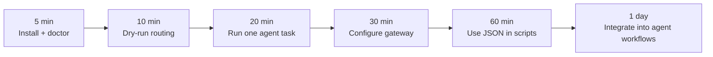

# cli-switch

**AI Agent Capability Router for coding CLIs.**

[](https://www.npmjs.com/package/cli-switch)
[](https://nodejs.org/)
[](./LICENSE)
[](https://www.typescriptlang.org/)

`cli-switch` is a command-line orchestration layer for AI coding agents. It
routes a task to the right agent, injects gateway credentials, chooses model
tiers, isolates the child process environment, and returns text or JSON output
that scripts and higher-level agents can consume.

Current public package: `cli-switch@0.3.2`

## Languages

- [English](#english)
- [中文](#中文)
- [日本語](#日本語)
- [한국어](#한국어)

---

## English

### What It Is

Modern coding agents are powerful, but every CLI has different authentication,
model flags, environment variables, strengths, and failure modes. `cli-switch`
adds a routing layer above those tools:

```text
task
  -> intent and capability detection
  -> agent and tier selection
  -> gateway credential injection
  -> sandboxed child process execution
  -> text or JSON result
```

It is designed for developers, automation scripts, and agent frameworks that
need one stable interface for multiple coding agents.

### What You Can Use It For

- Route coding tasks between Claude Code and Codex CLI.
- Use one gateway or self-hosted relay API key across supported agents.
- Reuse OpenRouter-style keys without changing each agent's global config.
- Run dry-run routing decisions before spending model tokens.
- Build higher-level agent workflows that need stable JSON output.
- Dispatch review, test-writing, refactor, explain, analysis, and fix tasks.
- Keep parent session variables out of child agent processes.
- Inspect local agent readiness with diagnostics and auth checks.

### Good Fit

| Scenario | Why `cli-switch` helps |
| --- | --- |
| Multi-agent coding workflow | Select Claude Code or Codex per task instead of hard-coding one tool. |
| Self-hosted LLM relay | Map relay credentials into agent-native env variables automatically. |
| Agent framework integration | Use `--json`, `--dry-run`, and stable command surfaces. |
| Cost and quality routing | Route by `economy`, `standard`, or `premium` model tiers. |
| CI-style diagnostics | Check env, auth, models, providers, and runtime specs from scripts. |

### Current Status

`cli-switch@0.3.2` is a usable early release. It is ready for practical testing
and internal workflows, but it is not the full v2.0 roadmap product yet.

Implemented today:

- `cli-switch run <task>` with smart routing.
- Agent override with `--agent claude-code|codex`.
- Execution modes: `single`, `write_review`, `write_test_fix`.
- Tier routing: `economy`, `standard`, `premium`.
- Gateway aliases: `SWITCH_*`, `SWITCH_RELAY_*`, `OPENROUTER_*`.
- JSON output for automation.
- Diagnostics: `resolve`, `env`, `auth status`, `doctor`, `list`.
- Capability matrix and benchmark simulation commands.
- Process environment isolation and gateway HOME isolation.
- Full TypeScript build and automated test suite.

Known limits:

- `--strategy balanced|high_quality|low_cost` is accepted but not implemented
  as a runtime cost strategy selector yet.
- Gateway injection currently targets Claude Code and Codex.
- Sandbox support is environment-level in v0.3.0. Full file policy, patch-only
  execution, temporary project copies, and worktree isolation are future work.
- `config show/set/reset` commands are not implemented yet.

### Install

```bash
npm install -g cli-switch
```

Verify:

```bash
cli-switch --version
cli-switch doctor --json
```

From source:

```bash
git clone https://github.com/zhoutian1995/cli-switch.git
cd cli-switch
npm install
npm run build
npm link
```

### Quick Start

Preview a routing decision:

```bash
cli-switch run "refactor the auth module" --dry-run
```

Run with automatic routing:

```bash
cli-switch run "write tests for the payment parser"
```

Force a specific agent:

```bash
cli-switch run "fix this TypeScript error" --agent codex
cli-switch run "review this architecture change" --agent claude-code
```

Use JSON output:

```bash
cli-switch run "explain this repository" --json
```

Use a model tier:

```bash
cli-switch run "debug the failing e2e test" --tier premium
```

Use an execution mode:

```bash
cli-switch run "implement login validation" --execution write_test_fix
```

### Gateway And Relay Configuration

Preferred variables:

```bash
export SWITCH_API_KEY=your-gateway-key
export SWITCH_BASE_URL=https://your-relay.example.com/v1
export SWITCH_MODEL_ECONOMY=your-economy-model
export SWITCH_MODEL_STANDARD=your-standard-model
export SWITCH_MODEL_PREMIUM=your-premium-model
```

Self-hosted relay aliases:

```bash
export SWITCH_RELAY_API_KEY=your-relay-key
export SWITCH_RELAY_BASE_URL=https://your-relay.example.com/v1
```

OpenRouter-compatible aliases:

```bash
export OPENROUTER_API_KEY=sk-or-v1-xxx
export OPENROUTER_BASE_URL=https://openrouter.ai/api/v1
```

Priority:

```text
SWITCH_* > SWITCH_RELAY_* > OPENROUTER_*
```

When gateway mode is enabled:

| Agent | Injected variables | Model flag |
| --- | --- | --- |
| Claude Code | `ANTHROPIC_API_KEY`, `ANTHROPIC_BASE_URL` | `--model` |
| Codex CLI | `OPENAI_API_KEY`, `OPENAI_BASE_URL` | `-m` |

If no gateway key is configured, the agent uses its native local auth.

### Commands

```bash
cli-switch resolve       # Resolve tool/profile/model to a runtime spec
cli-switch env           # Inspect environment and config sources
cli-switch auth status   # Check auth status for a tool
cli-switch doctor        # Run diagnostics
cli-switch list          # List models, providers, and profiles
cli-switch run           # Route and run an AI agent
cli-switch capabilities  # Show the capability matrix
cli-switch benchmark     # Run capability simulations across agents
```

Current `run` options:

```text
--mode <mode>        single|orchestrator|handoff|review
--agent <agent>      claude-code|codex
--strategy <name>    balanced|high_quality|low_cost (accepted, not implemented)
--execution <mode>   single|write_review|write_test_fix
--tier <tier>        economy|standard|premium
--json               output JSON
--dry-run            show routing decision without executing
--timeout <seconds>  agent timeout, default 120
--reviewer <agent>   reviewer agent for review mode
--no-git             skip Git guard
--rollback           try rollback on failure
--stream             stream output, default true
--no-stream          disable streaming
--interactive        interactive agent selection
--acp                JSON-RPC over stdio bridge
```

### Start Curve



### Architecture

```text
cmd/                  CLI command entrypoints
src/core/router/      capability and model routing
src/core/gateway/     gateway config and env injection
src/core/dispatcher/  agent process management
src/core/sandbox/     environment and HOME isolation helpers
src/core/strategy/    execution mode engine
src/registry/         built-in agents, models, providers, profiles
schema/               runtime and config JSON schemas
test/                 unit, contract, e2e, and stress tests
```

### Development

```bash
npm run build
npm test
npm run smoke
npm run lint
```

Verification baseline:

```text
35 test files
318 tests passing
```

### Roadmap

- Short term: stricter provider/vendor/transport resolution, platform and
  binary preflight checks, error-code closure, user config overrides.
- Mid term: richer execution policy, better strategy controls, stronger output
  validation.
- Later: full file sandboxing, patch-only execution, temporary project copies,
  worktree isolation, and richer skill workflows.

---

## 中文

### 项目定位

`cli-switch` 是一个面向 AI 编程 CLI 的能力路由层。它不替代 Claude Code
或 Codex CLI，而是在这些工具之上提供统一入口：识别任务、选择 Agent、注入
中转站凭据、选择模型档位、隔离子进程环境，并返回适合脚本或上层 Agent 使用
的文本/JSON 结果。

### 适用场景

- 你同时使用 Claude Code 和 Codex，希望按任务自动选择。
- 你有自建中转站，希望一套 API Key 映射到不同 Agent。
- 你在做 Hermes、OpenClaw 或其他 Agent 工作流，需要稳定 CLI 接口。
- 你希望先 `--dry-run` 看路由决策，再真正执行。
- 你希望用 `--json` 把 AI 编程能力接入自动化脚本。
- 你希望避免 Claude/Codex 子进程读取父进程会话变量或全局配置污染任务。

### 当前能力

- 已发布 npm 包：`cli-switch@0.3.2`。
- 支持 `cli-switch run <任务>`。
- 支持 `--agent claude-code|codex`。
- 支持 `--tier economy|standard|premium`。
- 支持 `--execution single|write_review|write_test_fix`。
- 支持 `SWITCH_*`、`SWITCH_RELAY_*`、`OPENROUTER_*` 环境变量。
- 支持 `resolve`、`env`、`auth status`、`doctor`、`list` 等诊断命令。
- 支持基础沙盒：环境变量隔离、gateway 场景临时 HOME 隔离。

### 边界说明

当前版本是 v0.3.0 可用基线，不是完整 v2.0。完整文件系统沙盒、patch-only
输出、worktree 隔离、配置管理命令和真正的 `--strategy` 成本策略仍在后续路线图。

### 快速开始

```bash
npm install -g cli-switch
cli-switch doctor --json
cli-switch run "帮我重构 auth 模块" --dry-run
cli-switch run "给 payment parser 写测试" --agent codex
```

---

## 日本語

### 概要

`cli-switch` は、AI コーディング CLI のための Agent Capability Router です。
Claude Code や Codex CLI を置き換えるものではなく、その上に薄い実行レイヤーを
追加し、タスクの意図判定、Agent 選択、ゲートウェイ認証情報の注入、モデル
Tier の選択、子プロセス環境の分離を行います。

### 利用シーン

- Claude Code と Codex CLI をタスクごとに使い分けたい。
- 自前の LLM リレーや OpenRouter 互換 Gateway を使いたい。
- 上位 Agent や自動化スクリプトから安定した CLI/JSON インターフェースを使いたい。
- 実行前に `--dry-run` でルーティング結果を確認したい。
- `economy`、`standard`、`premium` のようなモデル Tier でコストと品質を調整したい。

### 現在の状態

`cli-switch@0.3.2` は npm で公開済みの早期リリースです。実用テストや内部
ワークフローには利用できますが、v2.0 ロードマップの全機能はまだ実装されて
いません。

### クイックスタート

```bash
npm install -g cli-switch
cli-switch doctor --json
cli-switch run "refactor the auth module" --dry-run
cli-switch run "write tests for the payment parser" --agent codex
```

---

## 한국어

### 개요

`cli-switch`는 AI 코딩 CLI를 위한 Agent Capability Router입니다. Claude Code나
Codex CLI를 대체하는 도구가 아니라, 그 위에서 작업 의도 분석, Agent 선택,
Gateway 인증 정보 주입, 모델 Tier 선택, 자식 프로세스 환경 격리를 제공하는
오케스트레이션 레이어입니다.

### 사용하기 좋은 경우

- Claude Code와 Codex CLI를 작업별로 자동 선택하고 싶을 때.
- 자체 LLM relay 또는 OpenRouter 호환 Gateway를 사용하고 싶을 때.
- 상위 Agent 프레임워크나 자동화 스크립트에서 안정적인 CLI/JSON 출력을 원할 때.
- 실행 전에 `--dry-run`으로 라우팅 결정을 확인하고 싶을 때.
- `economy`, `standard`, `premium` Tier로 비용과 품질을 조정하고 싶을 때.

### 현재 상태

`cli-switch@0.3.2`은 npm에 공개된 초기 사용 가능 버전입니다. 내부 워크플로와
실사용 테스트에는 사용할 수 있지만, PRD의 전체 v2.0 기능이 모두 구현된 것은
아닙니다.

### 빠른 시작

```bash
npm install -g cli-switch
cli-switch doctor --json
cli-switch run "refactor the auth module" --dry-run
cli-switch run "write tests for the payment parser" --agent codex
```

---

## License

MIT
